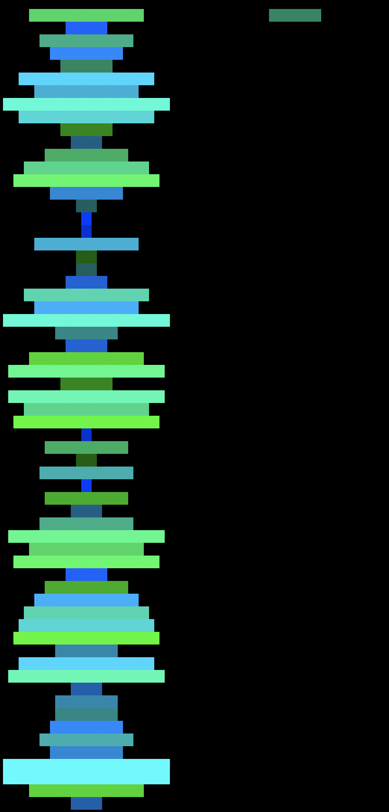
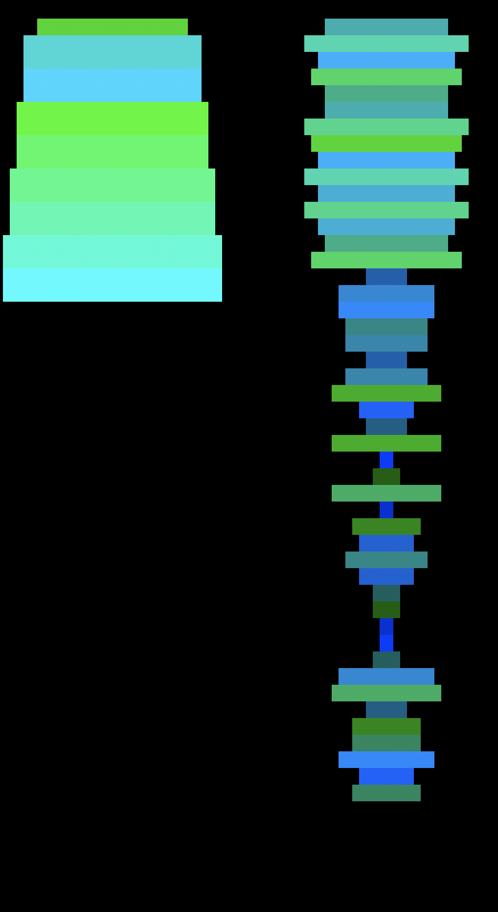
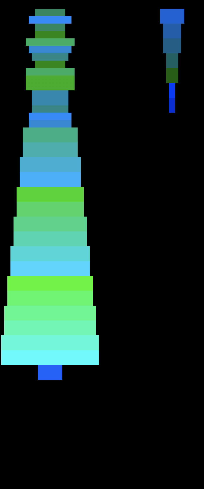
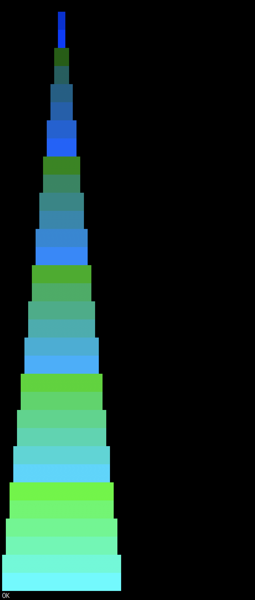

# push_swap

Given two stacks with only the operations push, swap, rotate, and reverse rotate, output and execute an efficient series of commands to sort a list of integers.

Although it isn't clear immediately why this project refers to stacks (with rotate and reverse rotate, doubly linked lists are a much cleaner way to store the data), a prerequisite for divide and conquer solutions is to quickly abandon any notion of circular lists. By reducing the amount of data being dealt with exponentially until it hits a constant size and merging these small subsets together, we achieve O(n lg(n)) asymptotic complexity. A basic visualizer (shown below) executes the instructions output by the main executable and displays intermediate states to the user, ultimately displaying whether or not the list was successfully sorted. For higher throughput testing, a simple checker will quickly return whether a series of actions results in a sorted list.

   
